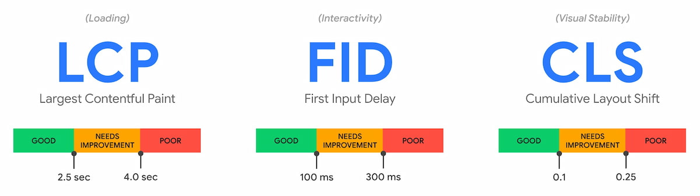

# 性能指标



## LCP
根据网页开始加载的时间报告可是区域内可见的最大图像或文本块完成渲染的计算时间.

```js
  const observer = new PerformanceObserver((entryList) => {
      for (const entry of entryList.getEntries()) {
        console.log('LCP candidate:', entry.startTime, entry);
      }
    });
    observer.observe({ type: "largest-contentful-paint", buffered: true });
```

## FID
首次输入延迟时间，主要为了测量页面加载期间响应度，测量交互性。
```js
new PerformanceObserver((entryList) => {
  for (const entry of entryList.getEntries()) {
    const delay = entry.processingStart - entry.startTime;
    console.log('FID candidate:', delay, entry);
  }
}).observe({type: 'first-input', buffered: true});
```

## CLS
描述累积布局偏移，测量整个页面生命周期内发生的所有意外布局偏移中最大一连串的布局偏移分数。具体这个分数是怎么算的呢，首先偏移前后的两个已渲染帧的总的叠加大小（只算可视区域内，重合部分只算一次），占可视区域的百分比，称为影响分数，例如有个元素一开始占可视区域的50%，然后下一帧往下偏移可视区域的25%，那么这个元素的影响分数就是0.75。然后取不稳定元素在一帧中的最大偏移距离（水平或垂直取最大）占对应可视区域（取水平对应宽度，垂直对应高度）的比例，称为距离分数，例如刚刚的例子，距离分数就是0.25。
距离分数和影响分数相乘就是偏移分数（例如上面例子相乘就是0.75 * 0.25 = 0.1875）。